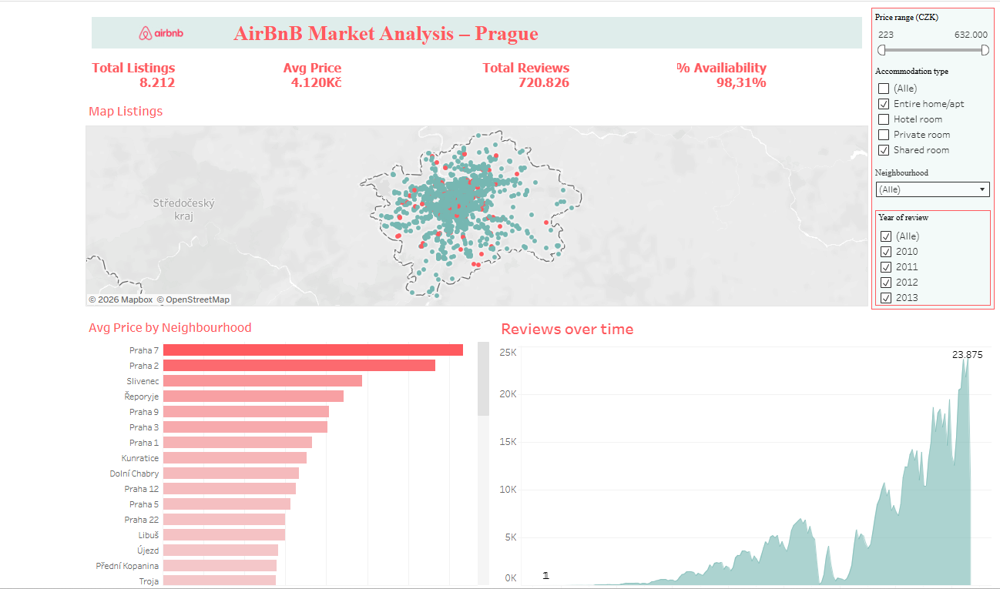

# airbnb-market-analysis-tableau
Interactive Tableau dashboard analyzing Airbnb listings in Prague including pricing trends, availability and geographic distribution.

# Airbnb Market Analysis – Prague

This project presents an interactive Tableau dashboard analyzing Airbnb listings in Prague.

## Dashboard Insights

- Total number of listings
- Average listing price
- Review trends over time
- Geographic distribution of listings
- Price comparison by neighbourhood

## Dashboard Preview

## Interactive Dashboard

You can explore the interactive version of this dashboard on Tableau Public:

[View the dashboard on Tableau Public]([LINK_AQUI](https://public.tableau.com/app/profile/sonicar.silvana.mayora.munoz/viz/Airbnb-Prague_17703570336390/Prague_Airbnb_Market))
